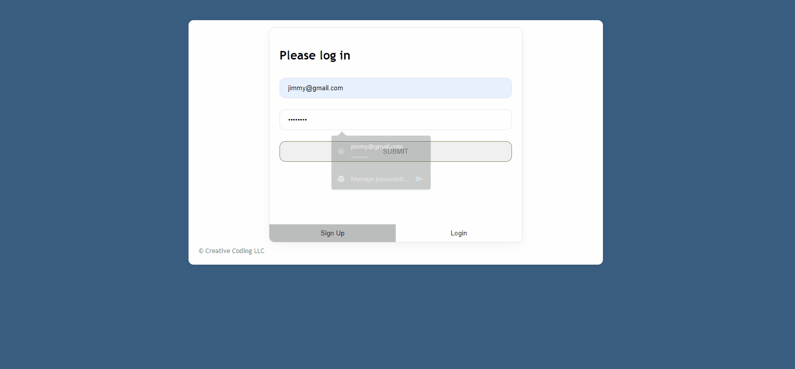

# holiday
 Fullstack app that allows users to make and show progress for their holiday shopping. 

**Link to project:**https://holiday-six.vercel.app/  

 

## How It's Made:

**Tech used:**  HTML, CSS, JavaScript, Express, Node, and PostgreSQL.

In this project I created a holiday list gift tracker that allows users to add items and track the progress on their items until completion. I added authentication and a login section soevery user has it personalized to them. 

## Optimizations

I added some simple colors to make the application more user friendly. I also made a progress tracker so that the user can decide if they are done with their shopping. I also tried to use as much simple and clean code as possible to make sure the application works as smooth as possible.

## Lessons Learned:
For this application I learned how to to use effectivly use PostgreSQL for my backend and SQL syntax.
From my client I decided to focus on my authentication skills and making simple CSS.
I learned how to enhance my skills in the seperation of concerns using 2 different technologies.

## Examples:
Take a look at these couple examples that I have in my own portfolio:

**Grub:**https://github.com/DominikJ22/grub

**Dont Forget:** https://github.com/DominikJ22/notes

**Ticket Tracker:** https://github.com/DominikJ22/ticket-tracker
